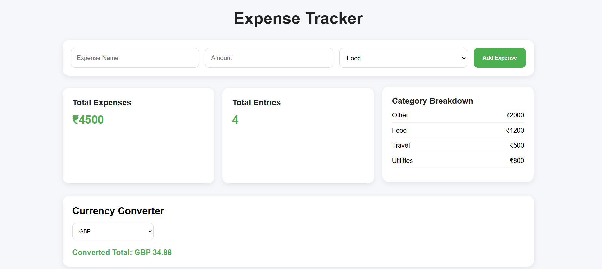
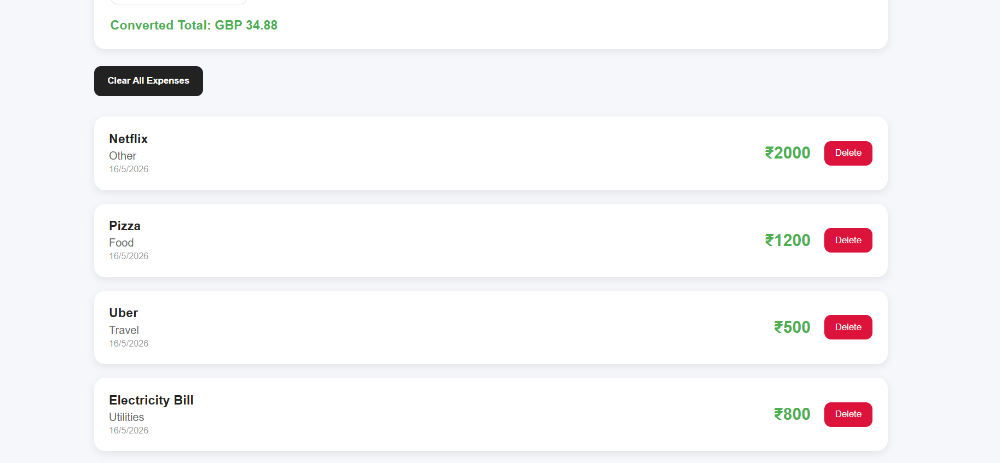
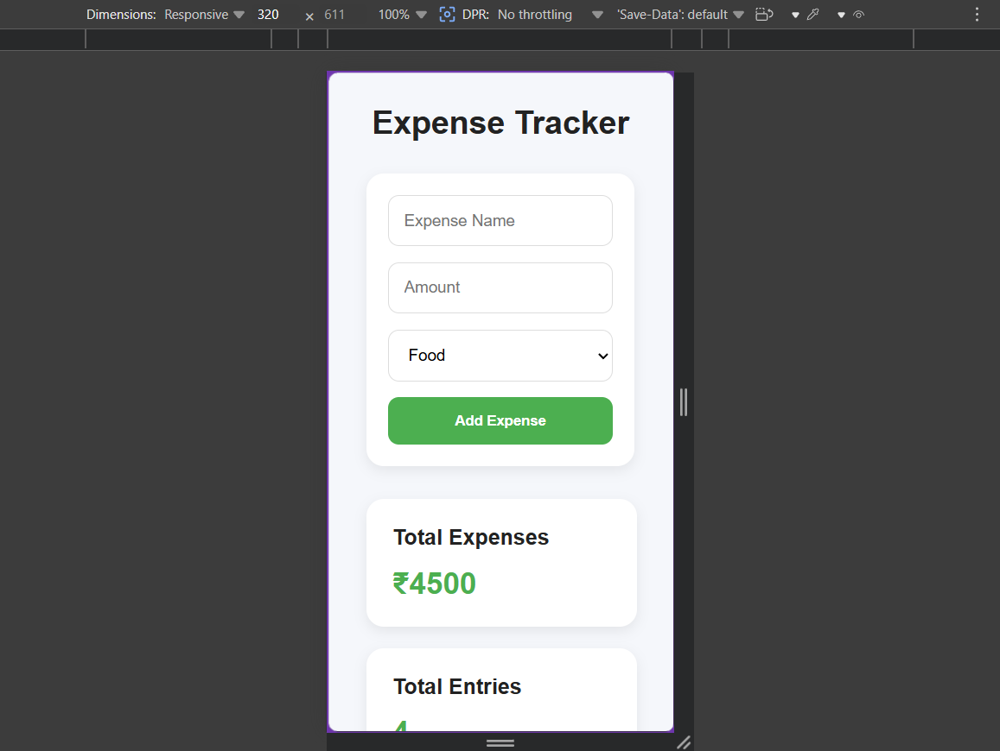
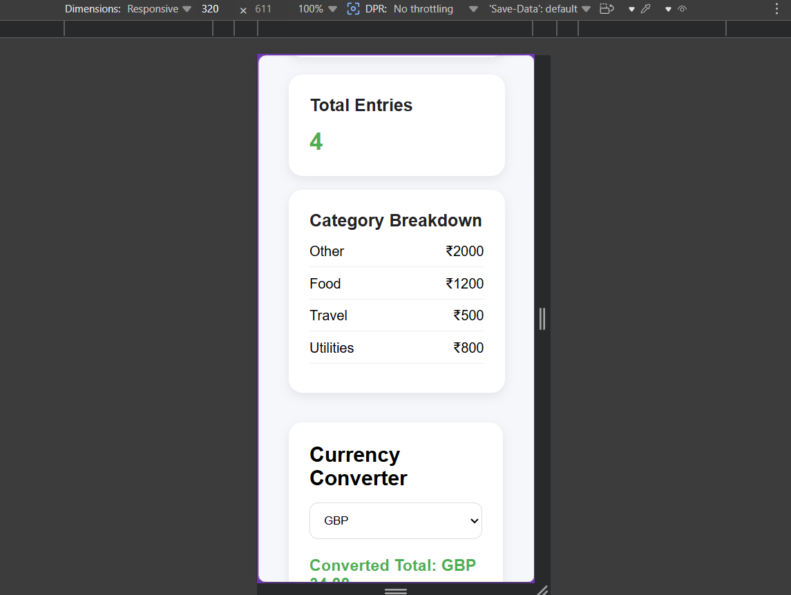
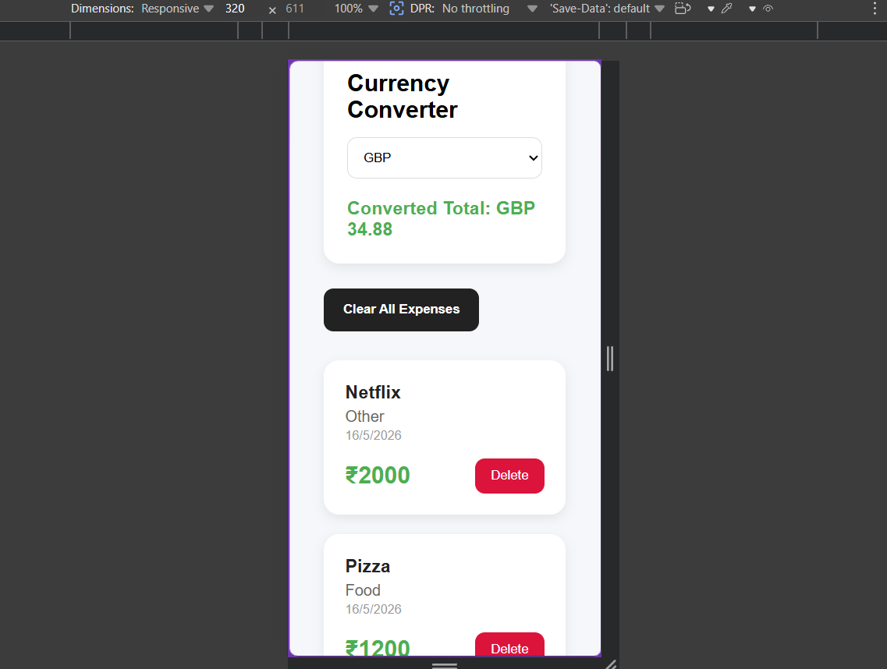
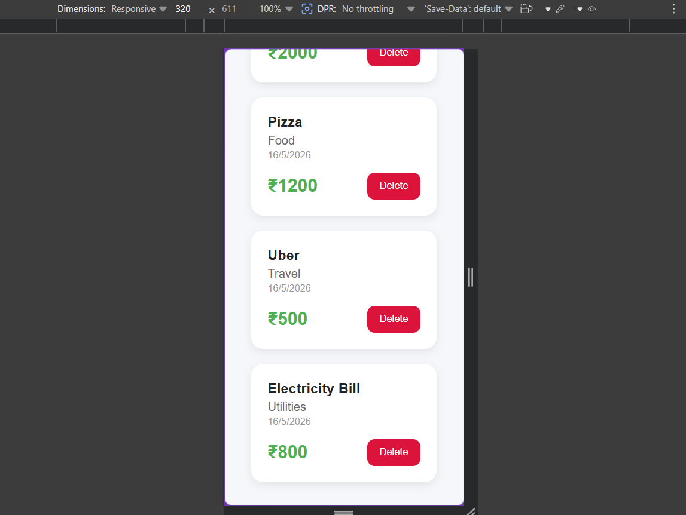

# Expense Tracker App

A responsive Expense Tracker application built using React.js and Vite.

---

## 🚀 Features

- Add and delete expenses
- Category-wise expense tracking
- Real-time expense calculation
- Live currency conversion using API
- LocalStorage persistence
- Responsive mobile-friendly design
- Clear all expenses functionality

---

## 🛠 Tech Stack

- React.js
- CSS
- Vite
- Exchange Rate API

---

## 📸 Screenshots

# 🖥 Desktop View

### Dashboard Overview

---

### Expense List Section

---

# 📱 Mobile View

### Mobile Home Screen

---

### Mobile Summary Section

---

### Mobile Currency Converter

---

### Mobile Expense Cards

---

## 🌐 Live Demo

https://prashant-expense-trackerapp.netlify.app/

---

## 👨‍💻 Author

Prashant Bhalerao